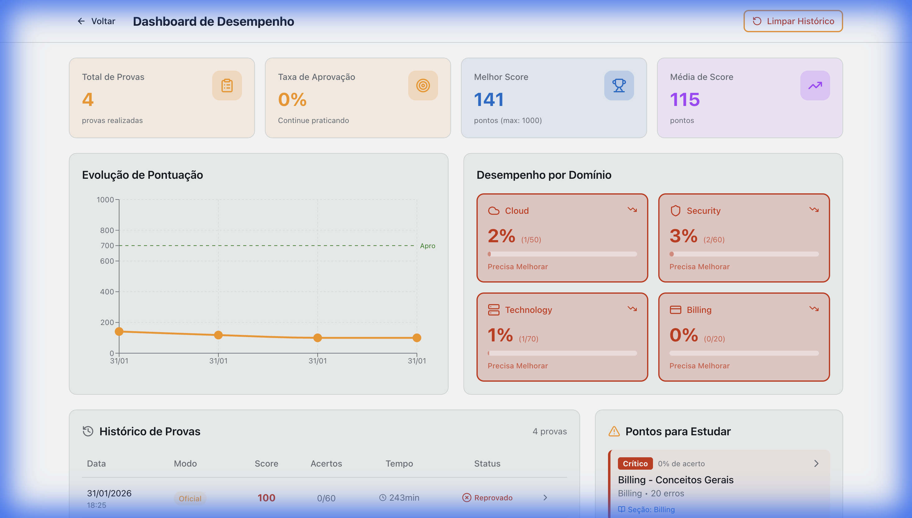
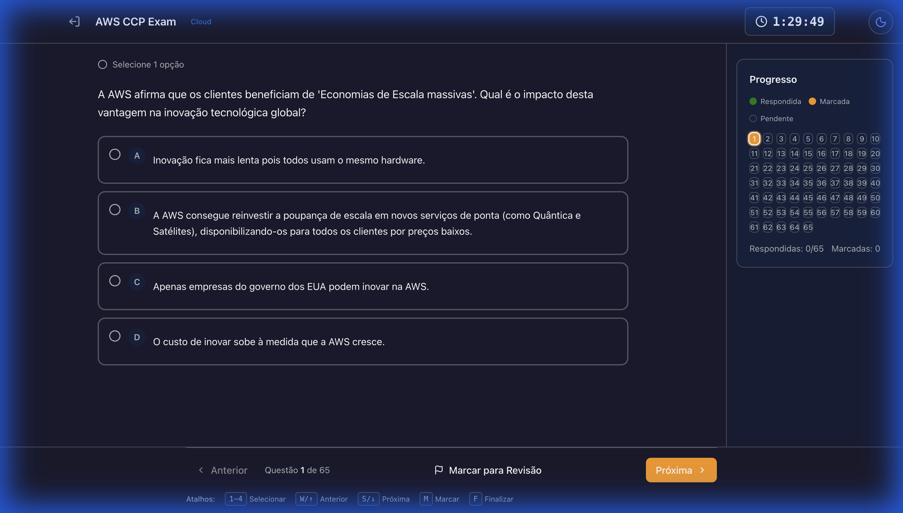
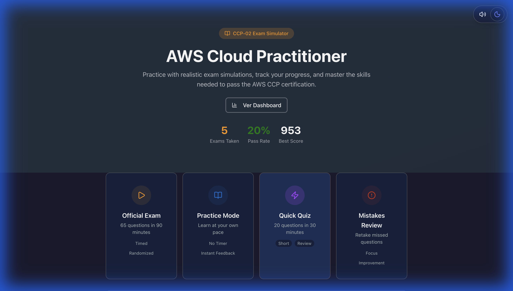

# AWS CCP Exam Simulator (CLF-C02)

💡 Projeto desenvolvido para auxiliar candidatos à certificação AWS Cloud Practitioner (CLF-C02). Baseado no guia oficial do exame.


## 🎯 Diferenciais Técnicos

- **Sistema Anti-Vício**: Algoritmo que evita repetição das últimas 3 provas.
- **Persistência Híbrida**: LocalStorage + API opcional com MongoDB.
- **Análise Preditiva**: Identifica padrões de erro por domínio AWS.
- **Docker-Ready**: Deploy completo com um comando.

## 📈 Números do Projeto

- 1.200+ questões baseadas no exame CLF-C02.
- 4 domínios AWS mapeados.
- 3 modos de estudo (Oficial, Prática, Revisão).
- 100% TypeScript para type-safety.

## ✨ Funcionalidades Principais

- **Simulação Realista**: Exames com 65 questões e temporizador, seguindo o formato oficial.
- **Dashboard Avançado**:
  - **Heatmap de Domínios**: Visualize desempenho em tempo real por área (Cloud Concepts, Security, etc).
  - **Análise de Pontos Fracos**: Algoritmo que agrupa e lista as questões que você mais erra.
  - **Gráficos de Evolução**: Histórico de progresso individual por domínio.
- **Histórico Persistente**: Seus dados são salvos automaticamente (LocalStorage ou MongoDB) para análise de tendências.
- **Modos de Estudo**:
  - **Oficial**: Simulação cronometrada e sem feedback imediato.
  - **Prática**: Sem tempo, com explicações imediatas e seleção personalizada de domínios.
  - **Revisão de Erros**: Gere provas focadas apenas nas questões que você errou anteriormente.
  - **Quick Exam**: Provas rápidas de 20 questões para treino diário.

## 🎬 Demonstração e Acesso

☁️ **Acesse agora**: [https://aws-ccp-simulator.vercel.app/](https://aws-ccp-simulator.vercel.app/)

Veja o fluxo completo (Home → Prova Prática → Dashboard):


## 📸 Screenshots

| Dashboard Analítico | Interface de Exame |
|---------------------|--------------------|
|  |  |

<p align="center">
  
</p>

## ✅ Status de Verificação

> **Testado e Validado (Fev/2026)**: Todas as funcionalidades essenciais (Router, State, Modais, Persistência) foram verificadas manualmente. O fluxo de build Docker e CI/CD está operacional.

## 🔒 Privacidade e Isolamento de Dados

Como a aplicação é distribuída via Vercel apenas como Frontend:
1.  **LocalStorage**: Todos os seus dados (progresso, histórico de exames) ficam salvos **apenas no seu navegador**.
2.  **Isolamento**: Não compartilhamos banco de dados. O histórico de um usuário não interfere no de outro.
3.  **Persistência**: Seus dados permanecem salvos enquanto você não limpar o cache do navegador.

## 🚀 Como Usar (Docker)

A maneira mais robusta de rodar a aplicação completa é via Docker:

```bash
# Clone e entre no diretório
git clone https://github.com/PedroHSSoares-Dev/aws-ccp-simulator.git
cd aws-ccp-simulator

# Inicie com Docker Compose (Frontend + Backend + Banco)
docker-compose -f docker-compose.prod.yml up -d
```
Acesse: **http://localhost**

## 🏗️ Arquitetura do Projeto

O projeto segue uma arquitetura moderna e escalável:

- **Frontend (SPA)**: React + Vite + TypeScript.
  - **State Management**: `Zustand` com persistência local para armazenar progresso do usuário e estado da prova em tempo real.
  - **Routing**: Navegação sem reload entre fluxos de Home, Prova, Resultados e Dashboard.
  - **Components**: UI modularizada com Tailwind CSS e Radix UI (via Headless UI).
  
- **Backend (Opcional)**:
  - API Node.js/Express para centralizar logs e persistência remota (quando usado via Docker).
  - MongoDB para salvar histórico de longo prazo.

- **DevOps**:
  - Pipeline de CI/CD (GitHub Actions) que constrói e publica imagens Docker automaticamente no GHCR.

## 💻 Desenvolvimento Local

```bash
# Instalar dependências
npm install

# Rodar Frontend (Modo Standalone - sem banco)
npm run dev
# O app detecta a ausência da API e usa LocalStorage automaticamente.
```

---

## 🤝 Contribuição

Encontrou um bug ou tem uma sugestão de melhoria? Sinta-se à vontade para contribuir!

1.  Abra uma **Issue** relatando o problema ou ideia.
2.  Faça um **Fork** do projeto.
3.  Crie uma branch para sua feature (`git checkout -b feature/minha-melhoria`).
4.  Submeta um **Pull Request**.

## 📄 Licença


...

## 📄 Licença

Este software é **Source Available** e gratuito para uso pessoal e educacional.

1.  **Permissões**: Você pode estudar, executar localmente e enviar **Pull Requests** com melhorias.
2.  **Restrições**: Proibido uso comercial (vender acesso, cursos, etc) sem autorização prévia.

Veja o arquivo [LICENSE](LICENSE) para detalhes completos e contato para licenciamento comercial.

© 2026 Pedro Henrique Simão Soares. Todos os direitos reservados.

---

*As questões foram geradas com base em simulados oficiais e documentação da AWS, processadas por IA para garantir diversidade e cobertura dos tópicos.*
